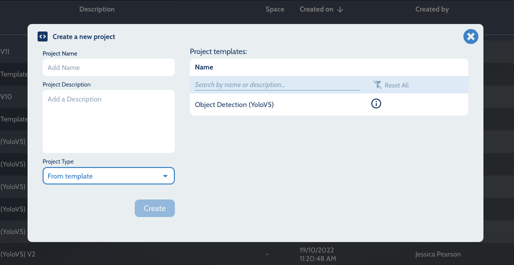
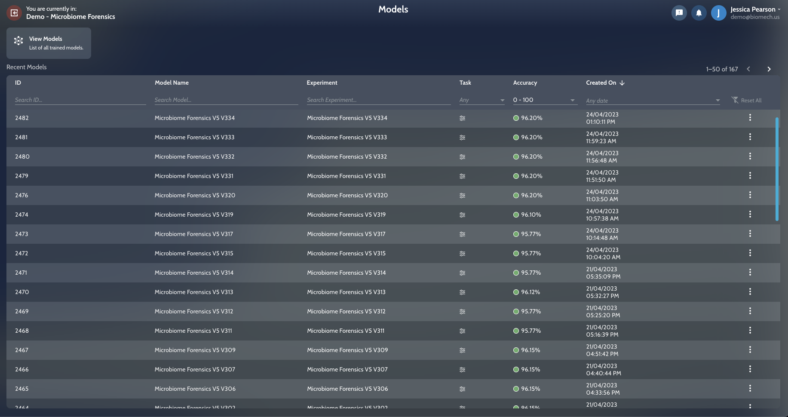
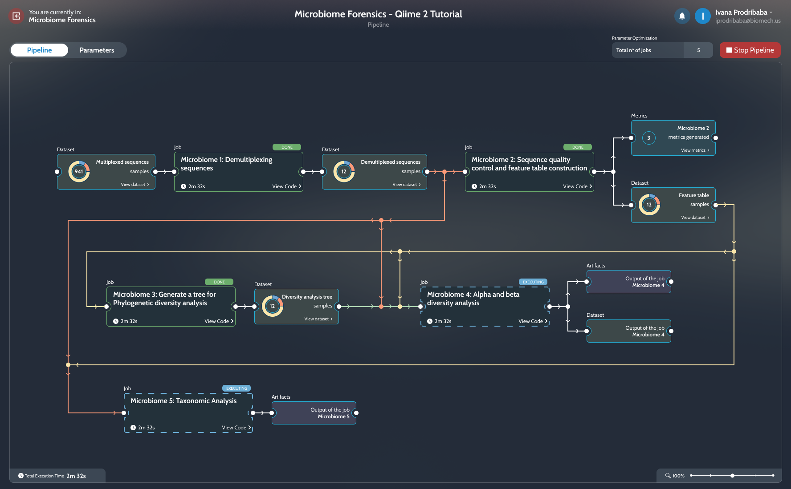
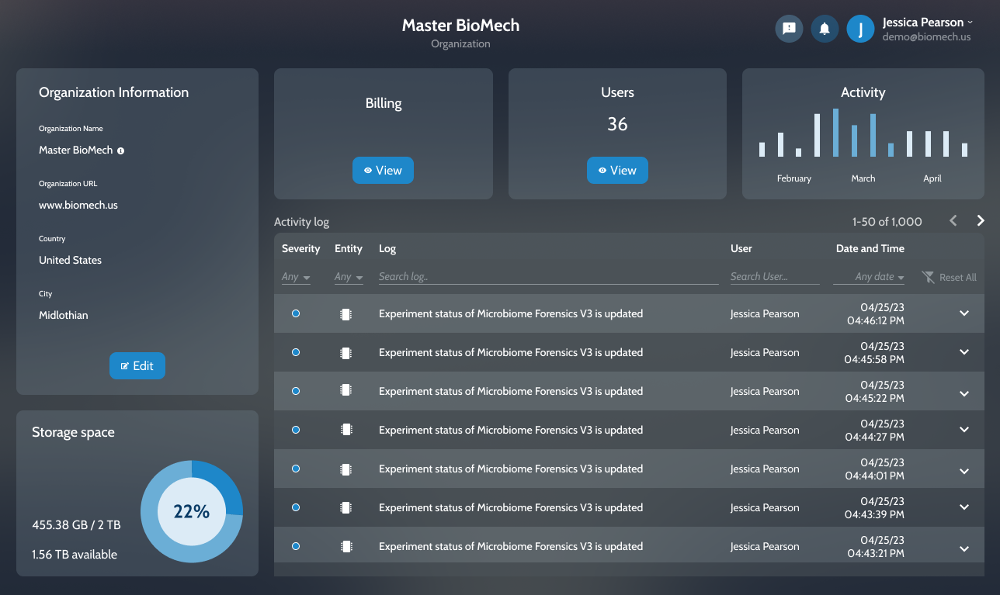
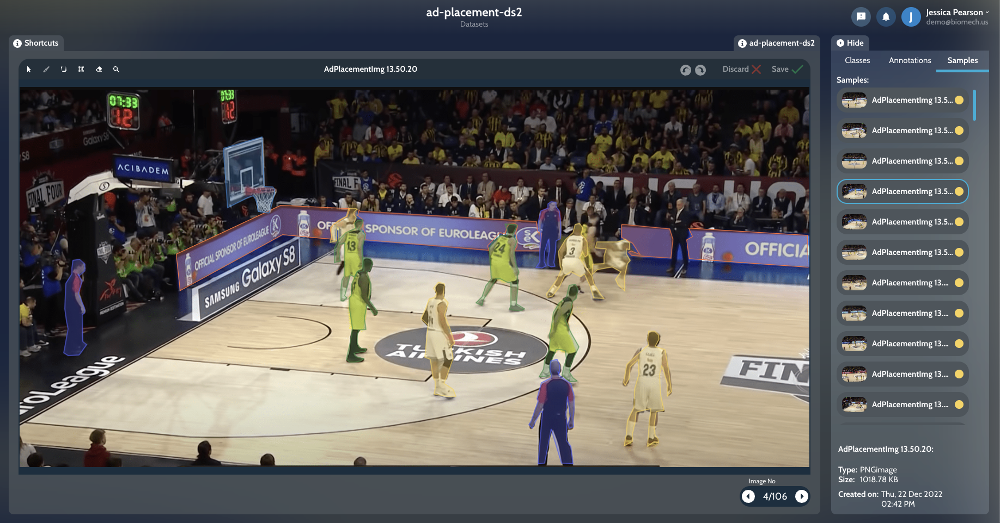
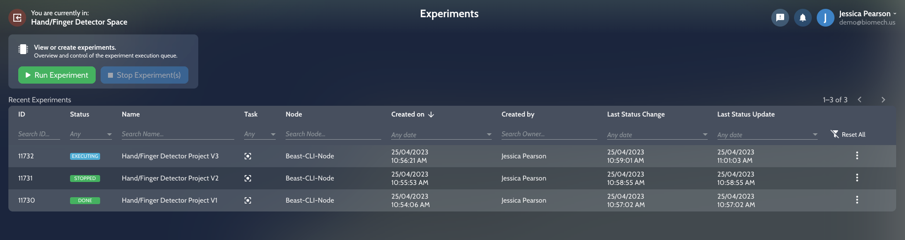
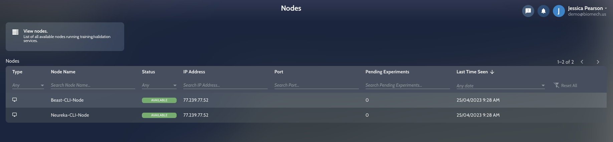

Main Page {#mainpage}
=========


Coretex.ai is a powerful MLOps platform designed to make AI experimentation fast and efficient. With Coretex.ai, data scientists, ML engineers, and less experienced users can easily:

* Run their data processing experiments,
* Build AI models,
* Perform statistical data analysis,
* Run computational simulations.

Coretex.ai helps you iterate faster and with more confidence. You get reproducibility, scalability, transparency, and cost-effectiveness.

## Get started

**Step 1:** [Sign up for a free account ->](https://coretex.ai/)

**Step 2:** Install coretex:

```bash
$ pip install coretex
```

**Step 3:** Migrate your project to coretex:

```python
from coretex import CustomDataset, ExecutingExperiment
from coretex.project import initializeProject


def main(experiment: ExecutingExperiment[CustomDataset]):
    # Remove "pass" and start project execution from here
    pass


if __name__ == "__main__":
    initializeProject(main)
```

(Read the documentation and learn how you can migrate your project to the Coretex platform -> [Migrate your project to Coretex](https://app.gitbook.com/o/6QxmEiF5ygi67vFH3kV1/s/YoN0XCeop3vrJ0hyRKxx/getting-started/demo-experiments/migrate-your-project-to-coretex))

## Key Features

Coretex.ai offers a range of features to support users in their AI experimentation, including:

* **Project Templates:** Battle-tested templates that make training ML models and processing data simple,



* **Machine Learning Model Creation:** Quick and easy creation of machine learning models, with less friction and more stability,



* **Optimized Pipeline Execution:** Execution optimization of any computational pipeline, including large-scale statistical analysis and various simulations,



* **Team Collaboration:** The whole workflow in Coretex is centered around this concept to help centralize user management and enable transparent monitoring of storage and compute resources for administrators,



* **Dataset Management and Annotation Tools:** Powerful tools for managing and annotating datasets,



* **Experiment Orchestration and Result Analysis:** Detailed management of experiments, ensuring reproducibility and easy comparison of results,



* **IT Infrastructure Setup:** Easy setup of IT infrastructure, whether connecting self-managed computers or using paid, dynamically scalable cloud computers,



* **Live Metrics Tracking:** Real-time tracking of experiment metrics during execution,


* **Artifact Upload and Management:** Easy upload and management of experiment artifacts, including models and results.


## Reproducibility

One of the key benefits of Coretex.ai is its ability to guarantee reproducibility. The platform keeps track of all experiment configurations and parameters between runs, ensuring that users never lose track of their work.

## Use Cases

Coretex.ai is a versatile platform that can be used for a variety of use cases, including:

* Training ML models,
* Large-scale statistical analysis,
* Simulations (physics, molecular dynamics, population dynamics, econometrics, and more).

## Compatibility

Coretex is compatible with all ML libraries such as Wandb, Tensorboard, PyTorch, and etc. There are no limits when it comes to Coretex integration with other libraries.

## Support

If you require any assistance or have any questions, our support team is available to help. Please feel free to reach out to us through our contact page or via email support@coretex.ai. We will be happy to assist you with any inquiries or issues you may have. Check out the Coretex platform overview at [coretex.ai](https://www.coretex.ai) for more information, tutorials, and documentation.
