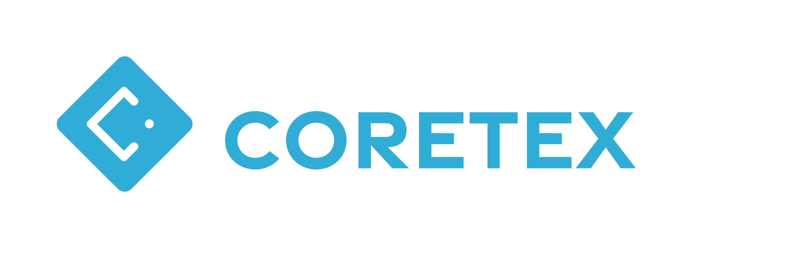
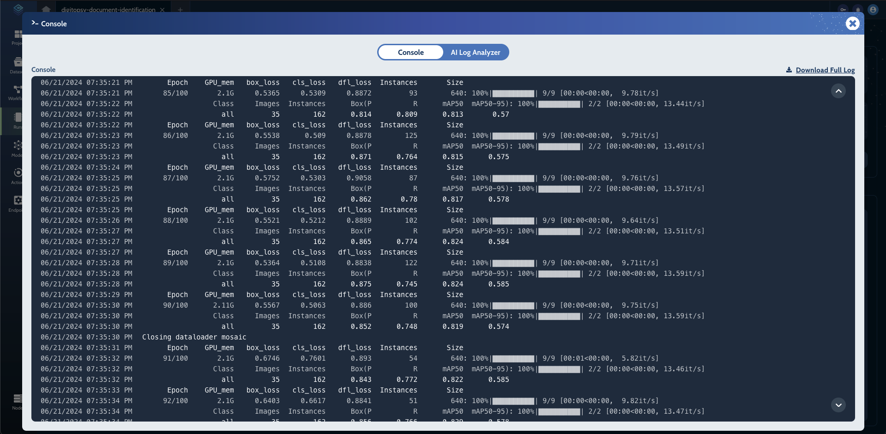
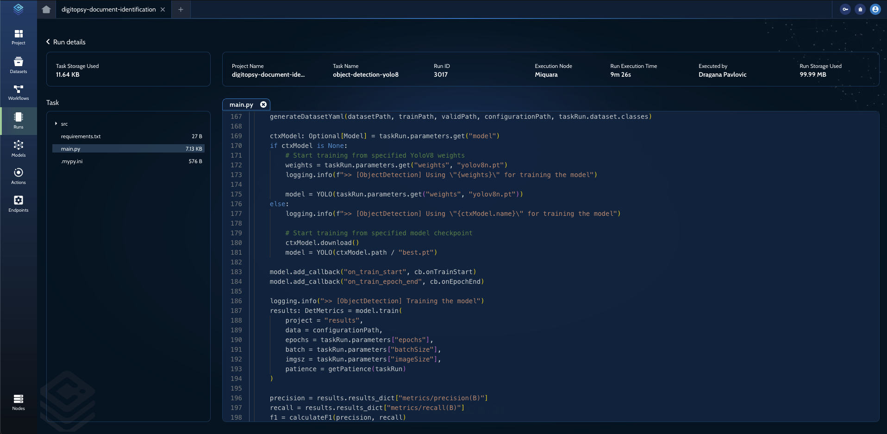

---
<div align="center">

[Coretex AI](https://www.coretex.ai) - Manage the complete lifecycle of your experiments and complex workloads, from project inception to production deployment and monitoring.
<br />

[](https://github.com/coretex-ai/coretexpylib/actions/workflows/linter-code-check.yml)
</div>


## What is Coretex?

Coretex is a powerful MLOps platform designed to make AI experimentation fast and efficient. It contains multiple key features to help with that:
- [MLOps Workflow Management]() - Use powerful yet simple tools to optimize, build and run your ML Workflows
- [Model Deployment](https://docs.coretex.ai/v1/getting-started/learn-basics/deployment) - Deploy your Model to production efforlessly with full tracking capabilities
- [Task Library](https://github.com/coretex-ai/coretex-jobs) - Out-of-the-box support for common ML Tasks:
    - LLM (Llama3)
    - RAG
    - Text-to-image (Stable Diffusion)
    - Object Detection (YOLOv10)
    - BioInformatics (Qiime2)
    - and many others...
- [Multi-language Support]() - You are not limited to just Python, with Coretex we support all of these:
    - Python (including Notebooks)
    - R
    - Bash
    - Docker - Define a custom Dockerfile which should be executed
- [Parameter Optimization](https://docs.coretex.ai/v1/getting-started/learn-basics/project-and-task#parameter-optimization) - Define multiple values for parameters and Coretex will magically take care of performing grid search using those parameters
- [Team Collaboration](https://docs.coretex.ai/v1/getting-started/learn-basics/organizations#collaboration-and-sharing) - Invite other people to collaborate with you on a Project by using a role-based access control (RBAC) for your Project
- [Dataset Management](https://docs.coretex.ai/v1/getting-started/learn-basics/dataset) - Manage your Datasets by using multitude of features provided by Coretex such as:
    - Support for annotatin images and IMU data directly on the platform
    - Combine and duplicate functionality for re-using or merging existing Datasets
    - Automatic Dataset lineage tracking which offers insight into how the Dataset was created
- [Real-time Experiment Tracking](#coretex-experiment-tracking) - Real-time tracking of Run metrics, Artifacts, stdout and stderr, etc...
- [Infrastructure Setup](#infrastructure-setup) - Connect your own on-premise machines, or use dynamically scalable cloud machines

Coretex helps you iterate faster and with more confidence. You get reproducibility, scalability, transparency, and cost-effectiveness.

## Get started

**Step 1:** [Sign up for free](https://app.coretex.ai/register-organization)

**Step 2:** Install Coretex python library:

```bash
$ pip3 install coretex
```
```bash
$ pip install coretex
```

**Step 3:** Run your project on Coretex with <b><u>zero changes</u></b>:

```bash
$ coretex run main.py
```

## Infrastructure Setup

Connecting your own on-premise machines or your cloud machines to an MLOps platform has never been easier. This can be achieved by running one simple command:
```bash
$ coretex node start
```

## Coretex Experiment Tracking

Coretex will automatically track:
- Source code and parameters
- Artifacts - files which are generated as a result of execution
- Console output - stdout and stderr
- Resouce usage (CPU, GPU, RAM, Swap, IO, network, etc...)

<table>
<tbody>
  <tr>
    <td>Metrics</td>
    <td>Artifacts</td>
  </tr>
  <tr>
    <td></td>
    <td></td>
  </tr>
  <tr>
    <td>Console</td>
    <td>Source code</td>
  </tr>
  <tr>
    <td></td>
    <td></td>
  </tr>
</tbody>
</table>

One of the key benefits of Coretex is its ability to guarantee reproducibility. Since the platform keeps track of code, all configurations and parameters between runs, this ensures that you can run the same identical Workflow over and over again.

## Supported Use Cases

Coretex is a versatile platform that can be used for a variety of use cases, including:

- Training ML models
- Large-scale statistical analysis
- Simulations (physics, molecular dynamics, population dynamics, econometrics, and more)
- Deploying all kinds of ML models (including LLMs)

## Compatibility with other libraries

Coretex is compatible with all existing Python ML frameworks (PyTorch, Tensorflow, Keras, XGBoost, Scikit-Learn, and many others). We also support using other libraries like Tensorboard, Weights & Biases, and others for tracking the experiments.

## Support

If you require any assistance or have any questions feel free to join our [Discord server](https://discord.gg/zm7PAtKZkn). You can also reach out to us through via email support@coretex.ai. We will be happy to assist you with any inquiries or issues you may have. Check out the Coretex platform overview at [coretex.ai](https://www.coretex.ai) for more information, tutorials, and documentation.
